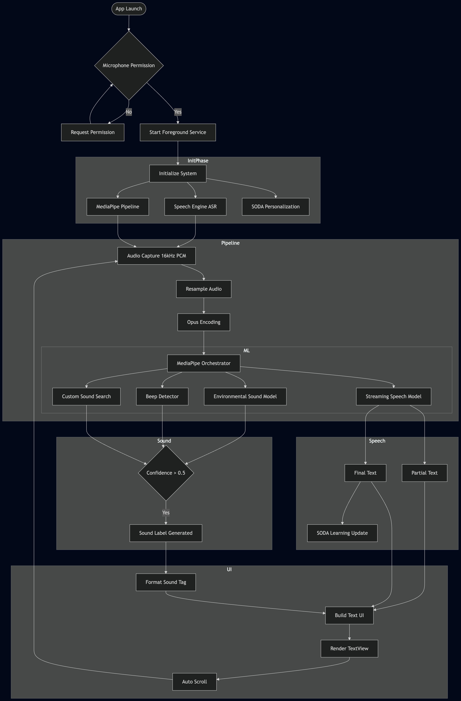

# Speech Recogniser Reverse Engineered: Live Transcribe & Sound Notifications

A comprehensive reverse-engineered repository of the **Google Live Transcribe and Sound Notifications** application (v8.7). This project explores the high-performance audio processing pipelines, on-device machine learning models, and real-time transcription engines that power Google's accessibility suite.

---

## 🚀 Overview

This repository contains the disassembled source code, native libraries, and machine learning assets required to understand and replicate Google's real-time speech-to-text and sound event detection (SED) system.

### Core Capabilities:
- **Scribe Engine (ASR)**: Hybrid online/offline speech recognition.
- **Dolphin Engine (SED)**: Real-time environmental sound classification (Doorbells, Alarms, Clapping, etc.).
- **SODA Integration**: Speech On-Device Adaptation for personalized voice learning.
- **MediaPipe Pipeline**: Advanced digital signal processing (DSP) using MediaPipe graphs.

---

## 🏗 System Architecture

The application operates through three primary modular engines working in parallel:

### 1. Scribe Engine (Speech-to-Text)
Handles the transformation of raw audio into text. It uses a combination of Android's `SpeechRecognizer` for online results and `earsnet_streaming_model.tflite` for low-latency offline transcription.

### 2. Dolphin Engine (Sound Detection)
Monitors the environment using the `audio_set_960ms.tflite` model. It detects over 30+ environmental sound categories with high precision using 960ms audio windows.

### 3. TextFlow Engine (Rendering)
A sophisticated UI orchestrator that manages `SpannableStringBuilder` to render partial transcripts (dimmed), final transcripts (solid), and sound event tags (bold orange) in a unified, auto-scrolling view.

---

## 📊 Technical Flow

---

## 📂 Project Structure

- **`assets/`**: Contains TFLite models (`models/`), MediaPipe graphs (`drishti_assets/`), and SODA configs.
- **`smali/`**: Disassembled Dalvik bytecode for the application logic.
- **`lib/`**: Native shared libraries (`.so`) for audio resampling, Opus encoding, and MediaPipe execution.
- **`res/`**: Application resources and UI layouts.
- **`REPLICATION_GUIDE.md`**: A detailed guide on how to build a clone using these components.

---

## 🛠 Tech Stack

- **Language**: Smali / JNI / Kotlin (for replication).
- **Audio Capture**: Android `AudioRecord` (16bit PCM, 16kHz).
- **ML Framework**: TensorFlow Lite & MediaPipe.
- **Encoding**: Ogg/Opus for efficient background audio processing.
- **DSP**: Fast Fourier Transform (FFT) and Mel-Spectrogram generation via MediaPipe.

---

## 📖 Getting Started

To understand the implementation details and how to replicate this functionality in your own apps, please refer to the following documents:

1. [**Replication Guide**](REPLICATION_GUIDE.md): Step-by-step instructions for building the engines.
2. [**Decompile Notes**](Google_live_transcription_decompile.md): Deep dive into the reverse engineering process.
3. [**Flowchart Documentation**](mermaid_flowchat_format.md): Visual breakdown of the system logic.

---

## ⚠️ Disclaimer

This project is for educational and research purposes only. "Live Transcribe" and "Sound Notifications" are trademarks of Google LLC.

